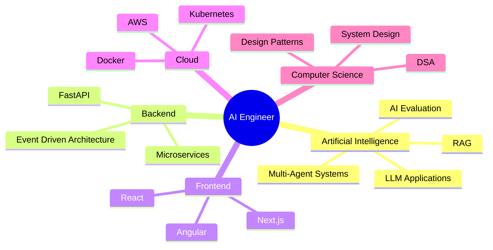

<!-- ===================================================== -->
<!--          GUDIDHA JITHENDRA • GITHUB PROFILE           -->
<!-- ===================================================== -->

<p align="center">


</p>

<p align="center">

<a href="YOUR_LINKEDIN">

</a>

<a href="mailto:YOUR_EMAIL">

</a>

<a href="https://github.com/YOUR_USERNAME">

</a>

</p>

---

<p align="center">


</p>

---

<p align="center">


</p>

---

# 👋 Hello, I'm Gudidha Jithendra

I'm an AI Engineer passionate about building intelligent systems that solve real-world problems.

I enjoy taking ideas from research to production—designing scalable backends, integrating LLMs, building intuitive user interfaces, and creating AI products that people can trust.

My interests include:

- 🤖 Artificial Intelligence
- 🧠 Machine Learning
- 🚀 Generative AI
- 💻 Full Stack Development
- ⚡ FastAPI & Backend Systems
- 🌐 Cloud Computing
- 🔒 Trustworthy AI
- 🏭 Industrial Automation
- 📊 Data Analytics
- ☁️ AI Infrastructure

---

## 🏆 Highlights

<table>
<tr>

<td align="center" width="25%">

### 🥇

ABB Accelerator

**Winner**

2026

</td>

<td align="center" width="25%">

### 🚀

Meta × PyTorch

National Finalist

OpenEnv

</td>

<td align="center" width="25%">

### 🤖

AI Engineer

ML Systems

Backend

</td>

<td align="center" width="25%">

### 🌍

Open Source

Hackathons

Innovation

</td>
<!-- ===================================================== -->
<!--                 PART 2 • ENGINEERING                  -->
<!-- ===================================================== -->

<h2 align="center">⚡ Engineering Snapshot</h2>

<table>
<tr>

<td width="50%">

### 🧠 About Me

I'm passionate about building software that blends **Artificial Intelligence**, **Backend Engineering**, and **Modern Web Technologies**.

Rather than building demos, I enjoy creating products that solve real-world problems—from industrial AI systems to healthcare intelligence platforms and civic technology.

My current focus is designing AI-powered applications that are:

- Production Ready
- Explainable
- Human-Centered
- Scalable
- Enterprise Friendly

</td>

<td width="50%">

```text
Name        : Gudidha Jithendra

Role        : AI / ML Engineer

Interests   : AI Systems
              Backend
              Full Stack
              GenAI

Current     : Angular
              System Design
              DSA

Location    : India

Open To     : Internships
              Research
              Hackathons
```

</td>

</tr>
</table>

---

# 🚀 Engineering Philosophy

> Build software that people trust.

I believe successful AI products are not just intelligent—they should also be understandable, reliable, and designed with users in mind.

My goal is to combine:

- AI
- Software Engineering
- Clean UI
- Reliable Backend Systems
- Cloud Infrastructure

to create applications that can move from prototype to production.

---

# 💻 Tech Stack

## Programming Languages

<p align="center">


</p>

---

## Frontend

<p align="center">


</p>

---

## Backend

<p align="center">


</p>

---

## Database

<p align="center">


</p>

---

## AI / Machine Learning

<p align="center">


</p>

---

## DevOps & Cloud

<p align="center">


</p>

---

# 📊 GitHub Analytics

<p align="center">


</p>

---

<p align="center">


</p>

---

# 🏆 GitHub Achievements

<p align="center">


</p>

---

# 📈 Contribution Graph

<p align="center">


</p>

---

# ⚙️ Current Focus

```text
🧠 Artificial Intelligence

███████████████████░░ 95%

⚡ Backend Engineering

██████████████████░░░ 90%

🌐 Full Stack Development

█████████████████░░░░ 85%

🚀 Generative AI

██████████████████░░░ 90%

📚 System Design

██████████████░░░░░░░ 70%

🧩 Data Structures & Algorithms

███████████████░░░░░░ 75%
```

---

# 💡 Currently Exploring

- 🤖 Multi-Agent AI Systems
- 🧠 LLM Applications
- ⚡ Angular Enterprise Applications
- ☁️ Cloud Native Architecture
- 🔒 Trustworthy AI
- 📈 System Design
- 🚀 Production-Grade Backend APIs
- 🏭 Industrial AI Solutions

---
<!-- ===================================================== -->
<!--              PART 3 • FEATURED PROJECTS               -->
<!-- ===================================================== -->

<h1 align="center">🚀 Featured Projects</h1>

<p align="center">
Projects that reflect my passion for building AI-powered, scalable, and user-centric software.
</p>

---

<table>
<tr>

<td width="50%">

# 🏭 ConfidenceOS

### Next-Generation Trust-Aware Industrial HMI

ConfidenceOS is an AI-assisted decision support platform designed for industrial control environments.

### Highlights

- 📊 Real-time operational dashboard
- 🤖 AI-powered confidence scoring
- ⚠️ Smart alarm prioritization
- 📈 Operational analytics
- 🔐 Read-only architecture
- 👥 Role-based workflows

### Tech Stack

`FastAPI`

`React`

`SQLite`

`WebSockets`

`TypeScript`

🏆 **Winner — ABB Accelerator Student Hackathon 2026**

</td>

<td width="50%">


</td>

</tr>
</table>

---

<table>
<tr>

<td width="50%">


</td>

<td width="50%">

# 🩺 MediLens

### AI Health Intelligence Platform

Transforms laboratory reports into clear, multilingual, easy-to-understand health insights.

### Features

- OCR-powered report extraction
- AI-generated explanations
- Context-aware health assistant
- Family profile support
- PDF report generation
- Audio summaries
- Multilingual support

### Tech Stack

`FastAPI`

`Python`

`Gemini`

`SQLite`

`Next.js`

</td>

</tr>
</table>

---

<table>
<tr>

<td width="50%">

# 🌍 CivicLens

### AI Civic Issue Reporting Platform

An intelligent platform that simplifies civic issue reporting by using AI to understand uploaded images and generate structured reports.

### Features

- AI image analysis
- Auto-generated descriptions
- Geolocation mapping
- Authority dashboard
- Real-time status tracking
- Analytics dashboard

### Tech

`Next.js`

`Firebase`

`Gemini`

`TypeScript`

`TailwindCSS`

</td>

<td width="50%">


</td>

</tr>
</table>

---

# 🏆 Achievements

<p align="center">

| Achievement | Details |
|-------------|---------|
| 🥇 ABB Accelerator Student Hackathon | **Winner (2026)** |
| 🚀 Meta × PyTorch OpenEnv | **National Finalist** |
| 🤖 AI/ML Engineering | Production-ready AI systems |
| 💻 Full Stack Development | End-to-end web applications |

</p>

---

# 📜 Certifications

<table>

<tr>

<td align="center">

☁️

### Google Cloud

</td>

<td align="center">

🚀

### AWS

</td>

<td align="center">

🤖

### NVIDIA

</td>

<td align="center">

🧠

### Databricks

</td>

</tr>

</table>

---

# 🧭 Engineering Journey

```text
2023
│
├── Started learning Python & Java
│
2024
│
├── Built Full Stack Projects
├── Explored Machine Learning
│
2025
│
├── AI Projects
├── Hackathons
├── Backend Development
│
2026
│
├── 🥇 ABB Accelerator Winner
├── 🚀 OpenEnv National Finalist
├── Enterprise AI Systems
└── Production-grade Applications
```

---

# 🎯 What I'm Focused On

- 🤖 AI Agents
- 🧠 LLM Applications
- ⚡ FastAPI
- 🌐 Angular
- ☁️ Cloud Native Systems
- 📊 System Design
- 🔐 Trustworthy AI
- 🚀 Scalable Backend Architecture

---

# 📬 Let's Connect

<p align="center">

<a href="YOUR_LINKEDIN">

</a>

<a href="mailto:YOUR_EMAIL">

</a>

<a href="https://github.com/YOUR_USERNAME">

</a>

</p>

---

<p align="center">


</p>
<!-- ===================================================== -->
<!--           PART 4 • PREMIUM PORTFOLIO SECTIONS         -->
<!-- ===================================================== -->

<h1 align="center">🌟 Beyond the Code</h1>

---

# 💭 Engineering Principles

> *Technology should empower people, not overwhelm them.*

Every project I build follows a few core principles:

- 🎯 Solve meaningful problems
- 🧠 Keep AI explainable and trustworthy
- ⚡ Prioritize performance and scalability
- 🔒 Respect privacy and security
- 💙 Design for humans first
- 🚀 Build products ready for production

---

# 🏅 Career Highlights

<table>

<tr>

<td align="center">

### 🥇

## ABB Accelerator

Winner

2026

</td>

<td align="center">

### 🚀

## Meta × PyTorch

National Finalist

OpenEnv Hackathon

</td>

<td align="center">

### 🤖

## AI Systems

Production Ready

Applications

</td>

<td align="center">

### 🌍

## Full Stack

Modern Web

Cloud Native

</td>

</tr>

</table>

---

# 📈 What I'm Learning



---

# 🛠 Development Workflow

```text
Idea 💡

↓

Research 📚

↓

Architecture 🏗

↓

Development 💻

↓

Testing 🧪

↓

Deployment 🚀

↓

Feedback 📊

↓

Iteration 🔄
```

---

# 📚 Favorite Technologies

| Area | Technologies |
|------|--------------|
| AI | Python, PyTorch, Gemini |
| Backend | FastAPI, Flask |
| Frontend | React, Next.js, Angular |
| Database | PostgreSQL, Firebase, SQLite |
| Cloud | Docker, AWS |
| Tools | Git, GitHub Actions, Linux |

---

# 🧩 Current Goals (2026)

- ✅ Master Angular
- ✅ Improve System Design
- ✅ Strengthen DSA
- ✅ Build production AI products
- ✅ Contribute to Open Source
- ✅ Publish technical articles
- ✅ Land an AI Engineering role

---

# 📊 Coding Activity

```text
Python            ████████████████████████ 95%

FastAPI           █████████████████████░░ 90%

React             ███████████████████░░░░ 85%

Angular           ██████████████░░░░░░░░░ 70%

Machine Learning  ████████████████████░░░ 90%

System Design     ███████████████░░░░░░░░ 75%
```

---

# 💬 Random Dev Quote

> "Great software isn't just code that works.
>
> It's software people trust."

---

# 🎯 2026 Roadmap

```text
AI Engineering
██████████████████████░░░ 90%

Cloud Engineering
████████████████░░░░░░░░░ 75%

System Design
███████████████░░░░░░░░░░ 70%

Open Source
██████████████████░░░░░░░ 80%

Research
█████████████████░░░░░░░░ 78%
```

---

# 🌍 Open To

✔ AI Engineer Internship

✔ Software Engineering Internship

✔ Open Source Collaboration

✔ Hackathons

✔ Research Projects

✔ Technical Communities

---

# ❤️ Thanks for Visiting

<p align="center">

If you enjoy my work,

⭐ consider starring my repositories.

Let's build something meaningful together.

</p>

---

<p align="center">


</p>

</tr>
</table>
